# e-Commerce 주문 서비스 ER Diagram

```mermaid
erDiagram
    users ||--|| user_point : "소유"
    users ||--o{ cart : "보유"
    users ||--o{ orders : "생성"
    users ||--o{ user_coupons : "소유"
    users ||--o{ point_history : "소유"
    coupon_metas ||--o{ user_coupons : "발급"
    coupon_metas ||--|| coupon_issue_policy : "하위"
    products ||--o{ product_options : "하위"
    product_options ||--|| product_option_stock : "소유"
    product_options ||--o{ cart : "추가"
    orders ||--o| user_coupons : "사용"

    orders ||--o{ order_items : "세부"
    product_options ||--o{ order_items : "포함"

    product_options ||--o{ stock_reservations : "재고 예약"
    orders ||--o{ stock_reservations : "생성"

    products ||--o{ product_statistics : "집계"




    users {
        bigint user_id PK
        varchar email UK "로그인 아이디"
        varchar password  "비밀번호"
        varchar name "사용자명"
        varchar role "역할"
        datetime created_at
        datetime updated_at
        datetime deleted_at
    }

    user_point {
        bigint user_point_id PK
        bigint user_id FK
        bigint balance "현재 포인트 잔액"
        datetime updated_at
        bigint version "낙관적 락 적용"
    }

    point_history {
        bigint point_history_id PK
        bigint user_id FK
        enum type "CHARGE, USE"
        bigint amount "변동 금액"
        bigint balance_after "변동 후 잔액"
        varchar description
        datetime created_at
    }

    products {
        bigint product_id PK
        varchar name "제품명"
        text description "설명"
        bigint base_price "기본 가격"
        varchar image_url
        datetime created_at
        datetime updated_at
    }

    product_options {
        bigint product_option_id PK
        bigint product_id FK
        varchar option_name "예: 색상-빨강, 사이즈-L"
        bigint price "금액(product테이블의 가격과 독립적인 값)"
        datetime created_at
    }

    product_option_stock {
        bigint product_option_stock_id PK
        bigint product_option_id FK "UK"
        bigint quantity "실제 재고 수량"
        datetime updated_at
        bigint version "낙관적 락 적용"
    }

    stock_reservations {
        bigint reservation_id PK
        bigint product_option_id FK
        bigint order_id FK
        int reserved_quantity "예약 수량"
        enum status "ACTIVE, CONFIRMED, CANCELLED, EXPIRED"
        datetime expires_at "예약 만료 시각"
        datetime created_at "예약 생성 시각"
    }

    cart {
        bigint cart_id PK
        bigint user_id FK
        bigint product_option_id FK
        int quantity "수량"
        datetime created_at
        datetime updated_at
    }

    coupon_metas {
        bigint coupon_id PK
        varchar coupon_name
        enum discount_type "PERCENTAGE(퍼센트 할인), FIXED_AMOUNT(정액 할인)"
        int discount_value "할인값 (PERCENTAGE: 10=10%, FIXED_AMOUNT: 1000=1000원)"
        int min_order_value "최소 주문 금액"
        datetime valid_from "유효기간 시작"
        datetime valid_until "유효기간 종료"
        datetime created_at
    }

    coupon_issue_policy{
        bigint coupon_issue_policy_id PK
        bigint coupon_id FK
        int total_quantity "전체 발급 가능 수량"
        int issued_quantity "발급된 수량"
        int limit_per_user "1인당 발급 제한 수량"
        int duration "발급일로부터 유효 날짜"
        bigint version "낙관적 락 적용"
    }

    user_coupons {
        bigint user_coupon_id PK
        bigint user_id FK
        bigint coupon_id FK
        enum status "ISSUED, USED, EXPIRED"
        datetime issued_at "발급 일시"
        datetime used_at "사용 일시"
        datetime expires_at "만료 일시"
    }

    orders {
        bigint order_id PK
        bigint user_id FK
        bigint user_coupon_id FK "nullable"
        enum status "PENDING, PAID, CANCELLED"
        bigint total_amount "총 상품 금액"
        bigint discount_amount "쿠폰 할인 금액"
        bigint use_point_amount "포인트 사용 금액"
        bigint final_amount "최종 결제 금액"
        datetime created_at
        datetime paid_at
    }

    order_items {
        bigint order_item_id PK
        bigint order_id FK
        bigint product_option_id FK
        int quantity "주문 수량"
        bigint unit_price "단가"
        bigint subtotal "소계"
        datetime created_at
    }

    product_statistics {
        bigint product_stat_id PK
        bigint product_id FK "UK with stat_date"
        date stat_date "집계 일자, UK"
        int daily_sales "당일 판매량"
        int weekly_sales "최근 7일 판매량"
        int monthly_sales "최근 30일 판매량"
        datetime updated_at
    }

```



> race condition이 예상되는 부분에 대해서 테이블을 수직분할하였습니다.
> + user 테이블 => user + user_point테이블
> + coupon => coupon_metas + coupon_issue_policy

## 인덱스 설정
### users
```sql
CREATE INDEX idx_users_email ON users(email);
```
---
### user_point
```sql
-- 로그인 용
CREATE INDEX idx_user_point_user ON user_point(user_id);
```
---

### point_history
```sql
-- 사용자별 포인트 이력 조회용
CREATE INDEX idx_point_history_user_created ON point_history(user_id, created_at DESC);
-- 특정 사용자의 특정 유형 이력 조회용
CREATE INDEX idx_point_history_user_type ON point_history(user_id, type, created_at DESC);
```
---

### products
```sql
-- 상품명 검색용 인덱스
CREATE INDEX idx_products_name ON products(name);
-- 상품 목록 조회용 인덱스들 (정렬별)
CREATE INDEX idx_products_created ON products(created_at DESC);
CREATE INDEX idx_products_base_price ON products(base_price ASC);
CREATE INDEX idx_products_base_price_desc ON products(base_price DESC);
```
---
### product_options
```sql
-- 특정 상품의 옵션 목록 조회용
CREATE INDEX idx_product_options_product ON product_options(product_id);
```
---

### product_option_stock
```sql
CREATE INDEX idx_stock_option ON product_option_stock(product_option_id);
```
---
### stock_reservations
```sql
-- 주문별 재고 예약 조회용
CREATE INDEX idx_reservations_order ON stock_reservations(order_id);
-- 옵션별 활성 예약 조회용 (재고 계산)
CREATE INDEX idx_reservations_option_status ON stock_reservations(product_option_id, status, expires_at);
-- 타임아웃 처리용 (만료된 예약 조회)
CREATE INDEX idx_reservations_expires ON stock_reservations(expires_at, status);
-- 주문별 옵션 예약 조회용 복합 인덱스
CREATE INDEX idx_reservations_order_option ON stock_reservations(order_id, product_option_id);
```
---

### cart
```sql
-- 사용자별 장바구니 조회용
CREATE INDEX idx_cart_user ON cart(user_id);
```
---

### coupon_metas
```sql
-- 유효 쿠폰 조회용
CREATE INDEX idx_coupon_metas_valid ON coupon_metas(valid_from, valid_until);
-- 만료 쿠폰 조회용
CREATE INDEX idx_coupon_metas_expired ON coupon_metas(valid_until);
```
---

### coupon_issue_policy
```sql
--- 쿠폰 별 정책 조회용
CREATE INDEX idx_coupon_issue_policy ON coupon_issue_policy(coupon_id);
```
---

### user_coupons
```sql
-- 사용자별 쿠폰 목록 조회용 (최신순)
CREATE INDEX idx_user_coupons_user_status ON user_coupons(user_id, status, issued_at DESC);
--- 쿠폰 만료 배치 처리용
CREATE INDEX idx_user_coupons_expired ON user_coupons(expires_at);
```
---
### orders
```sql
-- 사용자별 주문 내역 조회용 (최신순)
CREATE INDEX idx_orders_user_created ON orders(user_id, created_at DESC);
-- 사용자별 주문 상태 필터링용
CREATE INDEX idx_orders_user_status ON orders(user_id, status, created_at DESC);
```
---

### order_items
```sql
-- 주문별 상세 항목 조회용
CREATE INDEX idx_order_items_order ON order_items(order_id);
```
---
### product_statistics
```sql
-- 일별 인기
CREATE INDEX idx_daily ON product_statistics(stat_date,daily_sales DESC );
-- 1주일 인기
CREATE INDEX idx_weekly ON product_statistics(stat_date,weekly_sales DESC );
-- 1달 인기
CREATE INDEX idx_monthly ON product_statistics(monthly_sales DESC );
```

<br><br>

---

## e-Commerce 주문 서비스 DDL
> + MSA 환경을 고려하여 FK 제외
> + DB 에서의 UK 등의 제약조건을 제외하고 모든 제약은 어플리케이션단에서 처리 ,
> + updated_at 필드는 JPA Auditing을 사용한 처리.
> + 유저는 deleted_at을 통한 soft delete 사용
> + 상태 필드는 모두 varchar로 대체, 어플리케이션 단에서 enum 사용 후 db 저장 시 string값 저장


```sql
-- 사용자 테이블
CREATE TABLE users (
    user_id BIGINT NOT NULL AUTO_INCREMENT,
    email VARCHAR(100) NOT NULL,
    password VARCHAR(255) NOT NULL,
    name VARCHAR(50) NOT NULL,
    role VARCHAR(50) NOT NULL,
    created_at DATETIME NOT NULL DEFAULT CURRENT_TIMESTAMP,
    updated_at DATETIME NOT NULL DEFAULT CURRENT_TIMESTAMP,
    deleted_at DATETIME NULL,
    PRIMARY KEY (user_id)
) ENGINE=InnoDB DEFAULT CHARSET=utf8mb4 COLLATE=utf8mb4_unicode_ci COMMENT='사용자';

CREATE INDEX idx_users_email ON users(email);

-- 사용자 포인트 테이블
CREATE TABLE user_point (
    user_point_id BIGINT NOT NULL AUTO_INCREMENT,
    user_id BIGINT NOT NULL,
    balance BIGINT NOT NULL DEFAULT 0 COMMENT '현재 포인트 잔액',
    updated_at DATETIME NOT NULL DEFAULT CURRENT_TIMESTAMP,
    version BIGINT NOT NULL DEFAULT 0 COMMENT '낙관적 락',
    PRIMARY KEY (user_point_id)
) ENGINE=InnoDB DEFAULT CHARSET=utf8mb4 COLLATE=utf8mb4_unicode_ci COMMENT='사용자 포인트';

CREATE INDEX idx_user_point_user ON user_point(user_id);

-- 포인트 이력 테이블
CREATE TABLE point_history (
    point_history_id BIGINT NOT NULL AUTO_INCREMENT,
    user_id BIGINT NOT NULL,
    type VARCHAR(50) NOT NULL COMMENT 'CHARGE(충전), USE(사용)',
    amount BIGINT NOT NULL COMMENT '변동 금액',
    balance_after BIGINT NOT NULL COMMENT '변동 후 잔액',
    description VARCHAR(500),
    created_at DATETIME NOT NULL DEFAULT CURRENT_TIMESTAMP,
    PRIMARY KEY (point_history_id)
) ENGINE=InnoDB DEFAULT CHARSET=utf8mb4 COLLATE=utf8mb4_unicode_ci COMMENT='포인트 이력';

CREATE INDEX idx_point_history_user_created ON point_history(user_id, created_at DESC);
CREATE INDEX idx_point_history_user_type ON point_history(user_id, type, created_at DESC);


-- 상품 테이블
CREATE TABLE products (
    product_id BIGINT NOT NULL AUTO_INCREMENT,
    name VARCHAR(200) NOT NULL COMMENT '제품명',
    description TEXT COMMENT '설명',
    base_price BIGINT NOT NULL COMMENT '기본 가격',
    image_url VARCHAR(500),
    created_at DATETIME NOT NULL DEFAULT CURRENT_TIMESTAMP,
    updated_at DATETIME NOT NULL DEFAULT CURRENT_TIMESTAMP,
    PRIMARY KEY (product_id)
) ENGINE=InnoDB DEFAULT CHARSET=utf8mb4 COLLATE=utf8mb4_unicode_ci COMMENT='상품';

CREATE INDEX idx_products_name ON products(name);
CREATE INDEX idx_products_created ON products(created_at DESC);
CREATE INDEX idx_products_base_price ON products(base_price ASC);
CREATE INDEX idx_products_base_price_desc ON products(base_price DESC);

-- 상품 옵션 테이블
CREATE TABLE product_options (
    product_option_id BIGINT NOT NULL AUTO_INCREMENT,
    product_id BIGINT NOT NULL,
    option_name VARCHAR(100) NOT NULL COMMENT '색상, 사이즈',
    price BIGINT NOT NULL COMMENT '금액(product테이블의 가격과 독립적인 값)',
    created_at DATETIME NOT NULL DEFAULT CURRENT_TIMESTAMP,
    PRIMARY KEY (product_option_id)
) ENGINE=InnoDB DEFAULT CHARSET=utf8mb4 COLLATE=utf8mb4_unicode_ci COMMENT='상품 옵션';

CREATE INDEX idx_product_options_product ON product_options(product_id);

-- 상품 옵션 재고 테이블
CREATE TABLE product_option_stock (
    product_option_stock_id BIGINT NOT NULL AUTO_INCREMENT,
    product_option_id BIGINT NOT NULL,
    quantity BIGINT NOT NULL COMMENT '실제 재고 수량',
    updated_at DATETIME NOT NULL DEFAULT CURRENT_TIMESTAMP,
    version BIGINT NOT NULL DEFAULT 0 COMMENT '낙관적 락',
    PRIMARY KEY (product_option_stock_id)
) ENGINE=InnoDB DEFAULT CHARSET=utf8mb4 COLLATE=utf8mb4_unicode_ci COMMENT='상품 옵션 재고';

CREATE INDEX idx_stock_option ON product_option_stock(product_option_id);

-- 재고 예약 테이블
CREATE TABLE stock_reservations (
    reservation_id BIGINT NOT NULL AUTO_INCREMENT,
    product_option_id BIGINT NOT NULL,
    order_id BIGINT NOT NULL,
    reserved_quantity INT NOT NULL COMMENT '예약 수량',
    status VARCHAR(50) NOT NULL COMMENT 'ACTIVE, CONFIRMED, CANCELLED, EXPIRED',
    expires_at DATETIME NOT NULL COMMENT '예약 만료 시각',
    created_at DATETIME NOT NULL DEFAULT CURRENT_TIMESTAMP COMMENT '예약 생성 시각',
    PRIMARY KEY (reservation_id)
) ENGINE=InnoDB DEFAULT CHARSET=utf8mb4 COLLATE=utf8mb4_unicode_ci COMMENT='재고 예약';

CREATE INDEX idx_reservations_order ON stock_reservations(order_id);
CREATE INDEX idx_reservations_option_status ON stock_reservations(product_option_id, status, expires_at);
CREATE INDEX idx_reservations_expires ON stock_reservations(expires_at, status);
CREATE INDEX idx_reservations_order_option ON stock_reservations(order_id, product_option_id);

-- 상품 통계 테이블
CREATE TABLE product_statistics (
    product_stat_id BIGINT NOT NULL AUTO_INCREMENT,
    product_id BIGINT NOT NULL,
    stat_date DATE NOT NULL COMMENT '집계 일자',
    daily_sales INT NOT NULL DEFAULT 0 COMMENT '당일 판매량',
    weekly_sales INT NOT NULL DEFAULT 0 COMMENT '최근 7일 판매량',
    monthly_sales INT NOT NULL DEFAULT 0 COMMENT '최근 30일 판매량',
    updated_at DATETIME NOT NULL DEFAULT CURRENT_TIMESTAMP,
    PRIMARY KEY (product_stat_id)
) ENGINE=InnoDB DEFAULT CHARSET=utf8mb4 COLLATE=utf8mb4_unicode_ci COMMENT='상품 통계';

CREATE INDEX idx_statistics_daily ON product_statistics(stat_date, daily_sales DESC);
CREATE INDEX idx_statistics_weekly ON product_statistics(stat_date, weekly_sales DESC);
CREATE INDEX idx_statistics_monthly ON product_statistics(stat_date, monthly_sales DESC);


CREATE TABLE cart (
    cart_id BIGINT NOT NULL AUTO_INCREMENT,
    user_id BIGINT NOT NULL,
    product_option_id BIGINT NOT NULL,
    quantity INT NOT NULL COMMENT '수량',
    created_at DATETIME NOT NULL DEFAULT CURRENT_TIMESTAMP,
    updated_at DATETIME NOT NULL DEFAULT CURRENT_TIMESTAMP,
    PRIMARY KEY (cart_id)
) ENGINE=InnoDB DEFAULT CHARSET=utf8mb4 COLLATE=utf8mb4_unicode_ci COMMENT='장바구니';

CREATE INDEX idx_cart_user ON cart(user_id);


-- 쿠폰 메타 테이블
CREATE TABLE coupon_metas (
    coupon_id BIGINT NOT NULL AUTO_INCREMENT,
    coupon_name VARCHAR(100) NOT NULL,
    discount_type VARCHAR(50) NOT NULL COMMENT 'PERCENTAGE(퍼센트 할인), FIXED_AMOUNT(정액 할인)',
    discount_value INT NOT NULL COMMENT '할인값 (PERCENTAGE: 10=10%, FIXED_AMOUNT: 1000=1000원)',
    min_order_value INT NOT NULL COMMENT '최소 주문 금액',
    valid_from DATETIME NOT NULL COMMENT '유효기간 시작',
    valid_until DATETIME NOT NULL COMMENT '유효기간 종료',
    created_at DATETIME NOT NULL DEFAULT CURRENT_TIMESTAMP,
    PRIMARY KEY (coupon_id)
) ENGINE=InnoDB DEFAULT CHARSET=utf8mb4 COLLATE=utf8mb4_unicode_ci COMMENT='쿠폰 메타';

CREATE INDEX idx_coupon_metas_valid ON coupon_metas(valid_from, valid_until);
CREATE INDEX idx_coupon_metas_expired ON coupon_metas(valid_until);

-- 쿠폰 발급 정책 테이블
CREATE TABLE coupon_issue_policy (
    coupon_issue_policy_id BIGINT NOT NULL AUTO_INCREMENT,
    coupon_id BIGINT NOT NULL,
    total_quantity INT NOT NULL COMMENT '전체 발급 가능 수량',
    issued_quantity INT NOT NULL DEFAULT 0 COMMENT '발급된 수량',
    limit_per_user INT NOT NULL COMMENT '1인당 발급 제한 수량',
    duration INT NOT NULL COMMENT '발급일로부터 유효 날짜',
    version BIGINT NOT NULL DEFAULT 0 COMMENT '낙관적 락',
    PRIMARY KEY (coupon_issue_policy_id)
) ENGINE=InnoDB DEFAULT CHARSET=utf8mb4 COLLATE=utf8mb4_unicode_ci COMMENT='쿠폰 발급 정책';

CREATE INDEX idx_coupon_issue_policy ON coupon_issue_policy(coupon_id);

-- 사용자 쿠폰 테이블
CREATE TABLE user_coupons (
    user_coupon_id BIGINT NOT NULL AUTO_INCREMENT,
    user_id BIGINT NOT NULL,
    coupon_id BIGINT NOT NULL,
    status VARCHAR(50) NOT NULL COMMENT 'ISSUED(발급됨), USED(사용됨), EXPIRED(만료됨)',
    issued_at DATETIME NOT NULL COMMENT '발급 일시',
    used_at DATETIME NULL COMMENT '사용 일시',
    expires_at DATETIME NOT NULL COMMENT '만료 일시',
    PRIMARY KEY (user_coupon_id)
) ENGINE=InnoDB DEFAULT CHARSET=utf8mb4 COLLATE=utf8mb4_unicode_ci COMMENT='사용자 쿠폰';

CREATE INDEX idx_user_coupons_user_status ON user_coupons(user_id, status, issued_at DESC);
CREATE INDEX idx_user_coupons_expired ON user_coupons(expires_at);

-- ============================================
-- 주문 관련 테이블
-- ============================================

-- 주문 테이블
CREATE TABLE orders (
    order_id BIGINT NOT NULL AUTO_INCREMENT,
    user_id BIGINT NOT NULL,
    user_coupon_id BIGINT NULL COMMENT 'nullable',
    status VARCHAR(50) NOT NULL COMMENT 'PENDING, PAID, CANCELLED',
    total_amount BIGINT NOT NULL COMMENT '총 상품 금액',
    discount_amount BIGINT NOT NULL DEFAULT 0 COMMENT '쿠폰 할인 금액',
    use_point_amount BIGINT NOT NULL DEFAULT 0 COMMENT '포인트 사용 금액',
    final_amount BIGINT NOT NULL COMMENT '최종 결제 금액',
    created_at DATETIME NOT NULL DEFAULT CURRENT_TIMESTAMP,
    paid_at DATETIME NULL,
    PRIMARY KEY (order_id)
) ENGINE=InnoDB DEFAULT CHARSET=utf8mb4 COLLATE=utf8mb4_unicode_ci COMMENT='주문';

CREATE INDEX idx_orders_user_created ON orders(user_id, created_at DESC);
CREATE INDEX idx_orders_user_status ON orders(user_id, status, created_at DESC);

-- 주문 항목 테이블
CREATE TABLE order_items (
    order_item_id BIGINT NOT NULL AUTO_INCREMENT,
    order_id BIGINT NOT NULL,
    product_option_id BIGINT NOT NULL,
    quantity INT NOT NULL COMMENT '주문 수량',
    unit_price BIGINT NOT NULL COMMENT '단가',
    subtotal BIGINT NOT NULL COMMENT '소계',
    created_at DATETIME NOT NULL DEFAULT CURRENT_TIMESTAMP,
    PRIMARY KEY (order_item_id)
) ENGINE=InnoDB DEFAULT CHARSET=utf8mb4 COLLATE=utf8mb4_unicode_ci COMMENT='주문 항목';

CREATE INDEX idx_order_items_order ON order_items(order_id);

```