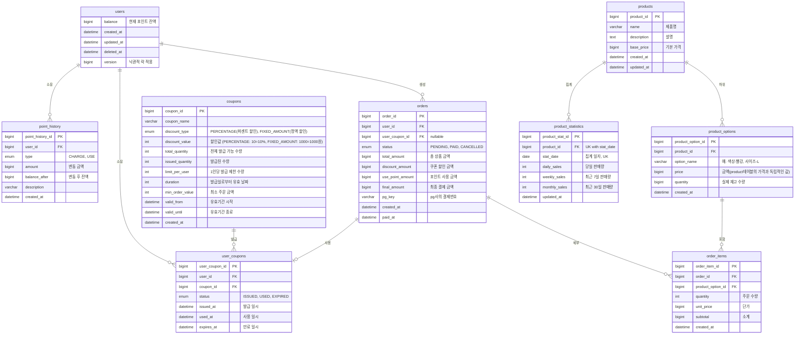

# e-Commerce 주문 서비스 ER Diagram

## 목차
1. [ERD](#erd)
2. [테이블 설계 원칙](#테이블-설계-원칙)
3. [인덱스 설정](#인덱스-설정)
4. [DDL](#e-commerce-주문-서비스-ddl)

---

## ERD



---

## 테이블 설계 원칙

### 동시성 제어 전략
동시성 제어가 필요한 테이블별로 적합한 락 전략을 적용하여 데이터 정합성을 보장합니다.

| 테이블              | 동시성 제어 방식              | 제어 대상                 | 선택 이유                                    |
|------------------|------------------------|----------------------|------------------------------------------|
| users            | 낙관적 락 (version)        | balance (포인트 잔액)      | 사용자별로 독립적이며 충돌 가능성 낮음                    |
| product_options  | 비관적 락 또는 Redis 분산 락   | quantity (재고 수량)      | 높은 동시성 환경, 충돌 시 재시도 비용 높음                |
| coupons          | Redis 분산 락 (또는 비관적 락) | issued_quantity (발급 수량) | 선착순 쿠폰 특성상 높은 동시 요청, 빠른 처리 필요            |

#### 락 전략 선택 기준

**낙관적 락 (Optimistic Lock)**
- **적합한 경우**: 충돌 가능성이 낮고, 충돌 시 재시도 비용이 적을 때
- **적용**: users.balance (포인트)
- **장점**: 락 대기 없이 빠른 처리, 데드락 없음
- **단점**: 충돌 시 재시도 필요, 높은 동시성 환경에 부적합

**비관적 락 (Pessimistic Lock)**
- **적합한 경우**: 충돌 가능성이 높고, 데이터 정합성이 매우 중요할 때
- **적용**: product_options.quantity (재고)
- **장점**: 확실한 정합성 보장, 충돌 시 대기만 하면 됨
- **단점**: 락 대기로 인한 성능 저하, 데드락 가능성

**Redis 분산 락 (Distributed Lock)**
- **적합한 경우**: 높은 동시성 + 빠른 응답 필요 + 여러 서버 환경
- **적용**: coupons.issued_quantity (선착순 쿠폰)
- **장점**:
  - 여러 서버 간 락 공유 가능
  - Redis의 빠른 성능 활용
  - Lua 스크립트로 원자적 연산 가능
- **단점**: Redis 장애 시 대응 필요

> **쿠폰 발급 최적화**: Redis에서 발급 가능 수량을 관리하고, Lua 스크립트로 원자적 차감 후 DB에 비동기로 반영하는 방식 권장

### 제약조건 설계
- **FK 제약조건**: MSA 환경을 고려하여 DB 레벨의 FK는 제외하고 애플리케이션 레벨에서 관리
- **UK 제약조건**: 비즈니스 로직상 필수적인 중복 방지만 DB 레벨에서 적용
  - users.email (중복 불가)
  - product_statistics (product_id, stat_date) 복합 유니크
- **Soft Delete**: users 테이블은 deleted_at을 통한 논리적 삭제 적용

---

## 인덱스 설정
### users
```sql
-- 이메일 검색용 (로그인)
CREATE INDEX idx_users_email ON users(email);
```
---

### point_history
```sql
-- 사용자별 포인트 이력 조회용
CREATE INDEX idx_point_history_user_created ON point_history(user_id, created_at DESC);
-- 특정 사용자의 특정 유형 이력 조회용
CREATE INDEX idx_point_history_user_type ON point_history(user_id, type, created_at DESC);
```
---

### products
```sql
-- 상품명 검색용 인덱스
CREATE INDEX idx_products_name ON products(name);
-- 상품 목록 조회용 인덱스들 (정렬별)
CREATE INDEX idx_products_created ON products(created_at DESC);
CREATE INDEX idx_products_base_price ON products(base_price ASC);
CREATE INDEX idx_products_base_price_desc ON products(base_price DESC);
```
---

### product_options
```sql
-- 특정 상품의 옵션 목록 조회용
CREATE INDEX idx_product_options_product ON product_options(product_id);
```
---

---

### coupons
```sql
-- 유효 쿠폰 조회용
CREATE INDEX idx_coupons_valid ON coupons(valid_from, valid_until);
-- 만료 쿠폰 조회용
CREATE INDEX idx_coupons_expired ON coupons(valid_until);
```
---

### user_coupons
```sql
-- 사용자별 쿠폰 목록 조회용 (최신순)
CREATE INDEX idx_user_coupons_user_status ON user_coupons(user_id, status, issued_at DESC);
-- 쿠폰 만료 배치 처리용
CREATE INDEX idx_user_coupons_expired ON user_coupons(expires_at);
```
---

### orders
```sql
-- 사용자별 주문 내역 조회용 (최신순)
CREATE INDEX idx_orders_user_created ON orders(user_id, created_at DESC);
-- 사용자별 주문 상태 필터링용
CREATE INDEX idx_orders_user_status ON orders(user_id, status, created_at DESC);
```
---

### order_items
```sql
-- 주문별 상세 항목 조회용
CREATE INDEX idx_order_items_order ON order_items(order_id);
```
---

### product_statistics
```sql
-- 상품별 통계 유니크 제약
CREATE UNIQUE INDEX uk_statistics_product_date ON product_statistics(product_id, stat_date);
-- 일별 인기 상품 조회용
CREATE INDEX idx_statistics_daily ON product_statistics(stat_date, daily_sales DESC);
-- 주간 인기 상품 조회용
CREATE INDEX idx_statistics_weekly ON product_statistics(stat_date, weekly_sales DESC);
-- 월간 인기 상품 조회용
CREATE INDEX idx_statistics_monthly ON product_statistics(stat_date, monthly_sales DESC);
```

<br><br>

---

## e-Commerce 주문 서비스 DDL

### DDL 작성 원칙
- **FK 제약조건**: MSA 환경을 고려하여 DB 레벨의 FK는 제외
- **UK 제약조건**: 비즈니스 로직상 필수적인 중복 방지만 DB 레벨에서 적용
- **Timestamp 관리**: updated_at은 JPA Auditing으로 자동 관리
- **Soft Delete**: users 테이블은 deleted_at을 통한 논리적 삭제
- **Enum 처리**: 상태 필드는 VARCHAR로 정의, 애플리케이션에서 enum 사용 후 문자열로 저장


```sql
-- 사용자 테이블
CREATE TABLE users (
    user_id BIGINT NOT NULL AUTO_INCREMENT,
    email VARCHAR(100) NOT NULL,
    password VARCHAR(255) NOT NULL,
    name VARCHAR(50) NOT NULL,
    role VARCHAR(50) NOT NULL,
    balance BIGINT NOT NULL DEFAULT 0 COMMENT '현재 포인트 잔액',
    created_at DATETIME NOT NULL DEFAULT CURRENT_TIMESTAMP,
    updated_at DATETIME NOT NULL DEFAULT CURRENT_TIMESTAMP,
    deleted_at DATETIME NULL,
    version BIGINT NOT NULL DEFAULT 0 COMMENT '낙관적 락',
    PRIMARY KEY (user_id)
) ENGINE=InnoDB DEFAULT CHARSET=utf8mb4 COLLATE=utf8mb4_unicode_ci COMMENT='사용자';

CREATE UNIQUE INDEX uk_users_email ON users(email);
CREATE INDEX idx_users_email ON users(email);

-- 포인트 이력 테이블
CREATE TABLE point_history (
    point_history_id BIGINT NOT NULL AUTO_INCREMENT,
    user_id BIGINT NOT NULL,
    type VARCHAR(50) NOT NULL COMMENT 'CHARGE(충전), USE(사용)',
    amount BIGINT NOT NULL COMMENT '변동 금액',
    balance_after BIGINT NOT NULL COMMENT '변동 후 잔액',
    description VARCHAR(500),
    created_at DATETIME NOT NULL DEFAULT CURRENT_TIMESTAMP,
    PRIMARY KEY (point_history_id)
) ENGINE=InnoDB DEFAULT CHARSET=utf8mb4 COLLATE=utf8mb4_unicode_ci COMMENT='포인트 이력';

CREATE INDEX idx_point_history_user_created ON point_history(user_id, created_at DESC);
CREATE INDEX idx_point_history_user_type ON point_history(user_id, type, created_at DESC);


-- 상품 테이블
CREATE TABLE products (
    product_id BIGINT NOT NULL AUTO_INCREMENT,
    name VARCHAR(200) NOT NULL COMMENT '제품명',
    description TEXT COMMENT '설명',
    base_price BIGINT NOT NULL COMMENT '기본 가격',
    created_at DATETIME NOT NULL DEFAULT CURRENT_TIMESTAMP,
    updated_at DATETIME NOT NULL DEFAULT CURRENT_TIMESTAMP,
    PRIMARY KEY (product_id)
) ENGINE=InnoDB DEFAULT CHARSET=utf8mb4 COLLATE=utf8mb4_unicode_ci COMMENT='상품';

CREATE INDEX idx_products_name ON products(name);
CREATE INDEX idx_products_created ON products(created_at DESC);
CREATE INDEX idx_products_base_price ON products(base_price ASC);
CREATE INDEX idx_products_base_price_desc ON products(base_price DESC);

-- 상품 옵션 테이블
CREATE TABLE product_options (
    product_option_id BIGINT NOT NULL AUTO_INCREMENT,
    product_id BIGINT NOT NULL,
    option_name VARCHAR(100) NOT NULL COMMENT '색상, 사이즈',
    price BIGINT NOT NULL COMMENT '금액(product테이블의 가격과 독립적인 값)',
    quantity BIGINT NOT NULL DEFAULT 0 COMMENT '실제 재고 수량',
    created_at DATETIME NOT NULL DEFAULT CURRENT_TIMESTAMP,
    PRIMARY KEY (product_option_id)
) ENGINE=InnoDB DEFAULT CHARSET=utf8mb4 COLLATE=utf8mb4_unicode_ci COMMENT='상품 옵션';

CREATE INDEX idx_product_options_product ON product_options(product_id);

-- 상품 통계 테이블
CREATE TABLE product_statistics (
    product_stat_id BIGINT NOT NULL AUTO_INCREMENT,
    product_id BIGINT NOT NULL,
    stat_date DATE NOT NULL COMMENT '집계 일자',
    daily_sales INT NOT NULL DEFAULT 0 COMMENT '당일 판매량',
    weekly_sales INT NOT NULL DEFAULT 0 COMMENT '최근 7일 판매량',
    monthly_sales INT NOT NULL DEFAULT 0 COMMENT '최근 30일 판매량',
    updated_at DATETIME NOT NULL DEFAULT CURRENT_TIMESTAMP,
    PRIMARY KEY (product_stat_id)
) ENGINE=InnoDB DEFAULT CHARSET=utf8mb4 COLLATE=utf8mb4_unicode_ci COMMENT='상품 통계';

CREATE UNIQUE INDEX uk_statistics_product_date ON product_statistics(product_id, stat_date);
CREATE INDEX idx_statistics_daily ON product_statistics(stat_date, daily_sales DESC);
CREATE INDEX idx_statistics_weekly ON product_statistics(stat_date, weekly_sales DESC);
CREATE INDEX idx_statistics_monthly ON product_statistics(stat_date, monthly_sales DESC);


-- 쿠폰 테이블
CREATE TABLE coupons (
    coupon_id BIGINT NOT NULL AUTO_INCREMENT,
    coupon_name VARCHAR(100) NOT NULL,
    discount_type VARCHAR(50) NOT NULL COMMENT 'PERCENTAGE(퍼센트 할인), FIXED_AMOUNT(정액 할인)',
    discount_value INT NOT NULL COMMENT '할인값 (PERCENTAGE: 10=10%, FIXED_AMOUNT: 1000=1000원)',
    total_quantity INT NOT NULL COMMENT '전체 발급 가능 수량',
    issued_quantity INT NOT NULL DEFAULT 0 COMMENT '발급된 수량 (참고용, 실제는 Redis에서 관리)',
    limit_per_user INT NOT NULL COMMENT '1인당 발급 제한 수량',
    duration INT NOT NULL COMMENT '발급일로부터 유효 날짜',
    min_order_value INT NOT NULL COMMENT '최소 주문 금액',
    valid_from DATETIME NOT NULL COMMENT '유효기간 시작',
    valid_until DATETIME NOT NULL COMMENT '유효기간 종료',
    created_at DATETIME NOT NULL DEFAULT CURRENT_TIMESTAMP,
    PRIMARY KEY (coupon_id)
) ENGINE=InnoDB DEFAULT CHARSET=utf8mb4 COLLATE=utf8mb4_unicode_ci COMMENT='쿠폰';

CREATE INDEX idx_coupons_valid ON coupons(valid_from, valid_until);
CREATE INDEX idx_coupons_expired ON coupons(valid_until);

-- 사용자 쿠폰 테이블
CREATE TABLE user_coupons (
    user_coupon_id BIGINT NOT NULL AUTO_INCREMENT,
    user_id BIGINT NOT NULL,
    coupon_id BIGINT NOT NULL,
    status VARCHAR(50) NOT NULL COMMENT 'ISSUED(발급됨), USED(사용됨), EXPIRED(만료됨)',
    issued_at DATETIME NOT NULL COMMENT '발급 일시',
    used_at DATETIME NULL COMMENT '사용 일시',
    expires_at DATETIME NOT NULL COMMENT '만료 일시',
    PRIMARY KEY (user_coupon_id)
) ENGINE=InnoDB DEFAULT CHARSET=utf8mb4 COLLATE=utf8mb4_unicode_ci COMMENT='사용자 쿠폰';

CREATE INDEX idx_user_coupons_user_status ON user_coupons(user_id, status, issued_at DESC);
CREATE INDEX idx_user_coupons_expired ON user_coupons(expires_at);

-- ============================================
-- 주문 관련 테이블
-- ============================================

-- 주문 테이블
CREATE TABLE orders (
    order_id BIGINT NOT NULL AUTO_INCREMENT,
    user_id BIGINT NOT NULL,
    user_coupon_id BIGINT NULL COMMENT 'nullable',
    status VARCHAR(50) NOT NULL COMMENT 'PENDING, PAID, CANCELLED',
    total_amount BIGINT NOT NULL COMMENT '총 상품 금액',
    discount_amount BIGINT NOT NULL DEFAULT 0 COMMENT '쿠폰 할인 금액',
    use_point_amount BIGINT NOT NULL DEFAULT 0 COMMENT '포인트 사용 금액',
    final_amount BIGINT NOT NULL COMMENT '최종 결제 금액',
    created_at DATETIME NOT NULL DEFAULT CURRENT_TIMESTAMP,
    paid_at DATETIME NULL,
    PRIMARY KEY (order_id)
) ENGINE=InnoDB DEFAULT CHARSET=utf8mb4 COLLATE=utf8mb4_unicode_ci COMMENT='주문';

CREATE INDEX idx_orders_user_created ON orders(user_id, created_at DESC);
CREATE INDEX idx_orders_user_status ON orders(user_id, status, created_at DESC);

-- 주문 항목 테이블
CREATE TABLE order_items (
    order_item_id BIGINT NOT NULL AUTO_INCREMENT,
    order_id BIGINT NOT NULL,
    product_option_id BIGINT NOT NULL,
    quantity INT NOT NULL COMMENT '주문 수량',
    unit_price BIGINT NOT NULL COMMENT '단가',
    subtotal BIGINT NOT NULL COMMENT '소계',
    created_at DATETIME NOT NULL DEFAULT CURRENT_TIMESTAMP,
    PRIMARY KEY (order_item_id)
) ENGINE=InnoDB DEFAULT CHARSET=utf8mb4 COLLATE=utf8mb4_unicode_ci COMMENT='주문 항목';

CREATE INDEX idx_order_items_order ON order_items(order_id);

```