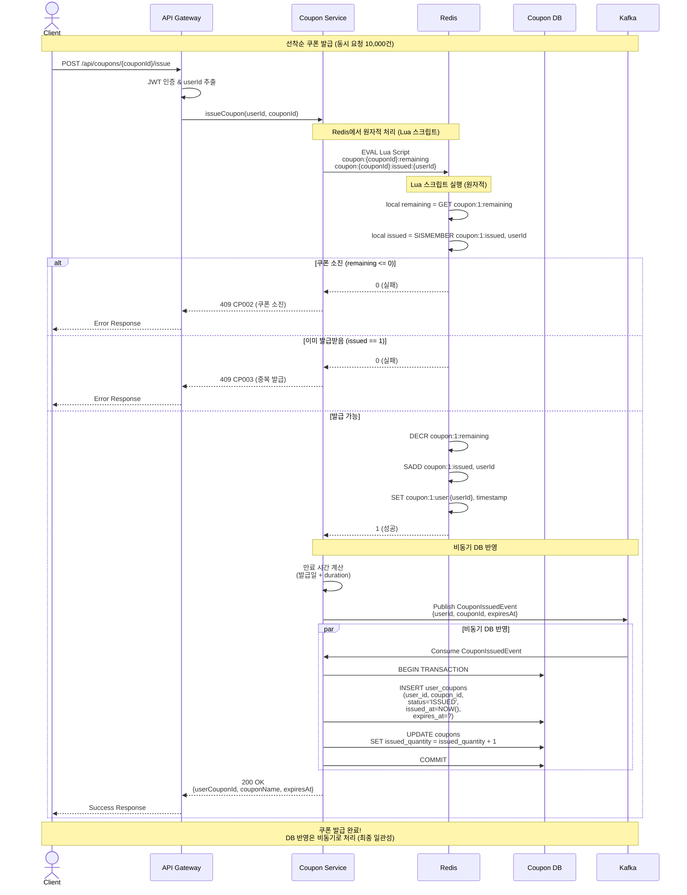
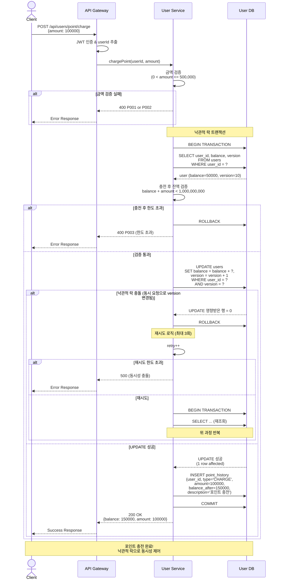

# e-Commerce 시퀀스 다이어그램 (MSA 구조)

## 목차
1. [MSA 서비스 구조](#msa-서비스-구조)
2. [주문 생성 및 결제](#1-주문-생성-및-결제)
3. [쿠폰 발급 (선착순)](#2-쿠폰-발급-선착순)
4. [포인트 충전](#3-포인트-충전)

---

## MSA 서비스 구조

본 프로젝트는 도메인별로 서비스를 분리한 MSA 구조를 가정합니다.

### 서비스 분리

| 서비스 | 책임 | 주요 테이블 |
|--------|------|-------------|
| **User Service** | 사용자 관리, 포인트 관리 | users, point_history |
| **Product Service** | 상품 관리, 재고 관리 | products, product_options, product_statistics |
| **Order Service** | 주문 관리, 결제 처리 | orders, order_items |
| **Coupon Service** | 쿠폰 관리, 발급 | coupons, user_coupons |
| **API Gateway** | 라우팅, 인증 | - |

### 공통 인프라

- **Redis**: 분산 락, 캐싱
- **Kafka**: 이벤트 기반 비동기 처리
- **Database**: 서비스별 독립 DB (Polyglot Persistence)

---

## 1. 주문 생성 및 결제

**복잡도**: ⭐⭐⭐⭐⭐ (최고)

**주요 특징**:
- 다중 서비스 간 트랜잭션 조율 (Order, Product, User, Coupon)
- 재고 차감 (비관적 락)
- 포인트 차감 (낙관적 락)
- 쿠폰 사용 처리
- 분산 트랜잭션 보상 처리 (Saga Pattern)

```mermaid
sequenceDiagram
    actor Client
    participant Gateway as API Gateway
    participant OrderSvc as Order Service
    participant ProductSvc as Product Service
    participant UserSvc as User Service
    participant CouponSvc as Coupon Service
    participant OrderDB as Order DB
    participant ProductDB as Product DB
    participant UserDB as User DB
    participant CouponDB as Coupon DB
    participant Kafka as Kafka
    participant Redis as Redis Cache

    %% 1. 주문 요청
    Client->>Gateway: POST /api/orders<br/>{items, userCouponId, usePointAmount}
    Gateway->>Gateway: JWT 인증 & userId 추출
    Gateway->>OrderSvc: createOrder(userId, request)

    %% 2. 주문 생성 (Saga 시작)
    OrderSvc->>OrderSvc: 주문 검증 (items 존재 여부)
    OrderSvc->>OrderDB: BEGIN TRANSACTION
    OrderSvc->>OrderDB: INSERT orders<br/>(status=PENDING)

    Note over OrderSvc,CouponDB: [Step 1] 쿠폰 검증 및 사용

    alt 쿠폰 사용하는 경우
        OrderSvc->>CouponSvc: validateAndUseCoupon(userId, userCouponId)
        CouponSvc->>CouponDB: SELECT user_coupons<br/>WHERE user_coupon_id = ?<br/>AND status = 'ISSUED'

        alt 쿠폰이 유효하지 않음
            CouponDB-->>CouponSvc: 결과 없음
            CouponSvc-->>OrderSvc: CouponInvalidException
            OrderSvc->>OrderDB: ROLLBACK
            OrderSvc-->>Gateway: 400 CP006 (사용 불가 쿠폰)
            Gateway-->>Client: Error Response
        else 쿠폰 유효
            CouponDB-->>CouponSvc: user_coupon 데이터
            CouponSvc->>CouponSvc: 최소 주문 금액 검증

            alt 최소 주문 금액 미달
                CouponSvc-->>OrderSvc: MinOrderAmountException
                OrderSvc->>OrderDB: ROLLBACK
                OrderSvc-->>Gateway: 400 CP007
                Gateway-->>Client: Error Response
            else 검증 통과
                CouponSvc->>CouponDB: UPDATE user_coupons<br/>SET status='USED', used_at=NOW()
                CouponSvc-->>OrderSvc: CouponUsageResult<br/>(discountAmount)
            end
        end
    end

    Note over OrderSvc,ProductDB: [Step 2] 재고 확인 및 차감 (비관적 락)

    loop 각 주문 항목에 대해
        OrderSvc->>ProductSvc: reserveStock(productOptionId, quantity)
        ProductSvc->>ProductDB: BEGIN TRANSACTION
        ProductSvc->>ProductDB: SELECT * FROM product_options<br/>WHERE product_option_id = ?<br/>FOR UPDATE (비관적 락)
        ProductDB-->>ProductSvc: product_option (locked)

        alt 재고 부족
            ProductSvc->>ProductSvc: quantity < requested
            ProductSvc->>ProductDB: ROLLBACK
            ProductSvc-->>OrderSvc: StockShortageException

            Note over OrderSvc,CouponSvc: 보상 트랜잭션 (Compensation)

            alt 쿠폰을 사용한 경우
                OrderSvc->>CouponSvc: rollbackCouponUsage(userCouponId)
                CouponSvc->>CouponDB: UPDATE user_coupons<br/>SET status='ISSUED', used_at=NULL
            end

            OrderSvc->>OrderDB: ROLLBACK
            OrderSvc-->>Gateway: 400 ST001 (재고 부족)
            Gateway-->>Client: Error Response
        else 재고 충분
            ProductSvc->>ProductDB: UPDATE product_options<br/>SET quantity = quantity - ?
            ProductSvc->>ProductDB: COMMIT
            ProductSvc-->>OrderSvc: StockReservationResult
        end
    end

    Note over OrderSvc,UserDB: [Step 3] 포인트 차감 (낙관적 락)

    alt 포인트 사용하는 경우
        OrderSvc->>UserSvc: deductPoint(userId, usePointAmount)
        UserSvc->>UserDB: BEGIN TRANSACTION
        UserSvc->>UserDB: SELECT * FROM users<br/>WHERE user_id = ?
        UserDB-->>UserSvc: user (balance, version)

        alt 포인트 부족
            UserSvc->>UserSvc: balance < usePointAmount
            UserSvc->>UserDB: ROLLBACK
            UserSvc-->>OrderSvc: InsufficientPointException

            Note over OrderSvc,ProductSvc: 보상 트랜잭션 (Compensation)

            loop 각 주문 항목에 대해
                OrderSvc->>ProductSvc: rollbackStock(productOptionId, quantity)
                ProductSvc->>ProductDB: UPDATE product_options<br/>SET quantity = quantity + ?
            end

            alt 쿠폰을 사용한 경우
                OrderSvc->>CouponSvc: rollbackCouponUsage(userCouponId)
                CouponSvc->>CouponDB: UPDATE user_coupons<br/>SET status='ISSUED', used_at=NULL
            end

            OrderSvc->>OrderDB: ROLLBACK
            OrderSvc-->>Gateway: 400 P004 (포인트 부족)
            Gateway-->>Client: Error Response
        else 포인트 충분
            UserSvc->>UserDB: UPDATE users<br/>SET balance = balance - ?,<br/>version = version + 1<br/>WHERE user_id = ? AND version = ?

            alt 낙관적 락 충돌 (version 불일치)
                UserDB-->>UserSvc: UPDATE 영향받은 행 = 0
                UserSvc->>UserDB: ROLLBACK
                UserSvc-->>OrderSvc: OptimisticLockException

                Note over OrderSvc: 재시도 로직 (최대 3회)
                OrderSvc->>OrderSvc: retry++

                alt 재시도 한도 초과
                    Note over OrderSvc,ProductSvc: 보상 트랜잭션
                    OrderSvc->>ProductSvc: rollbackStock(...)
                    OrderSvc->>CouponSvc: rollbackCouponUsage(...)
                    OrderSvc->>OrderDB: ROLLBACK
                    OrderSvc-->>Gateway: 500 (낙관적 락 충돌)
                    Gateway-->>Client: Error Response
                else 재시도
                    OrderSvc->>UserSvc: deductPoint(retry)
                end
            else 포인트 차감 성공
                UserDB-->>UserSvc: UPDATE 성공
                UserSvc->>UserDB: INSERT point_history<br/>(type='USE', amount=usePointAmount)
                UserSvc->>UserDB: COMMIT
                UserSvc-->>OrderSvc: PointDeductionResult
            end
        end
    end

    Note over OrderSvc,Kafka: [Step 4] 주문 완료 처리

    OrderSvc->>OrderDB: INSERT order_items<br/>(주문 항목들)
    OrderSvc->>OrderDB: UPDATE orders<br/>SET status='PAID',<br/>total_amount=?,<br/>discount_amount=?,<br/>use_point_amount=?,<br/>final_amount=?,<br/>paid_at=NOW()
    OrderSvc->>OrderDB: COMMIT

    Note over OrderSvc,Kafka: 비동기 이벤트 발행

    OrderSvc->>Kafka: Publish OrderCompletedEvent<br/>{orderId, userId, items, finalAmount}

    par 비동기 처리
        Kafka->>ProductSvc: Consume OrderCompletedEvent
        ProductSvc->>ProductDB: UPDATE product_statistics<br/>판매량 증가

        and
        Kafka->>UserSvc: Consume OrderCompletedEvent
        UserSvc->>UserSvc: 적립 포인트 계산 (finalAmount * 0.01)
        UserSvc->>UserDB: UPDATE users<br/>SET balance = balance + 적립포인트
        UserSvc->>UserDB: INSERT point_history<br/>(type='EARN', amount=적립포인트)

        and
        Kafka->>Redis: Consume OrderCompletedEvent
        Redis->>Redis: 인기 상품 캐시 무효화
    end

    OrderSvc-->>Gateway: 200 OK<br/>{orderId, status, totalAmount, ...}
    Gateway-->>Client: Success Response

    Note over Client,Kafka: 주문 완료!<br/>통계, 포인트 적립은 비동기 처리
```



---

## 2. 쿠폰 발급 (선착순)

**복잡도**: ⭐⭐⭐⭐

**주요 특징**:
- 높은 동시성 처리 (10,000명이 100개 쿠폰 요청)
- Redis 분산 락 + Lua 스크립트
- 비동기 DB 반영 (Kafka)



**Redis Lua 스크립트 예시**:
```lua
local couponKey = KEYS[1]  -- coupon:{couponId}:remaining
local issuedSetKey = KEYS[2]  -- coupon:{couponId}:issued
local userId = ARGV[1]

local remaining = tonumber(redis.call('GET', couponKey))
local alreadyIssued = redis.call('SISMEMBER', issuedSetKey, userId)

if remaining == nil or remaining <= 0 then
    return 0  -- 쿠폰 소진
end

if alreadyIssued == 1 then
    return 0  -- 이미 발급받음
end

redis.call('DECR', couponKey)
redis.call('SADD', issuedSetKey, userId)
return 1  -- 발급 성공
```

---

## 3. 포인트 충전

**복잡도**: ⭐⭐

**주요 특징**:
- 낙관적 락 (Optimistic Lock)
- 충돌 시 재시도 로직
- 포인트 이력 기록



---

## 주요 설계 포인트

### 1. 분산 트랜잭션 처리

**Saga Pattern (Orchestration)** 사용:
- Order Service가 Orchestrator 역할
- 각 단계별 보상 트랜잭션(Compensation) 정의
- 실패 시 이미 완료된 작업을 순서대로 롤백

**보상 트랜잭션 순서**:
1. 포인트 차감 실패 → 재고 복구 + 쿠폰 복구
2. 재고 차감 실패 → 쿠폰 복구
3. 쿠폰 검증 실패 → 주문 취소

### 2. 동시성 제어 전략

| 리소스 | 전략 | 이유 |
|--------|------|------|
| 재고 (product_options.quantity) | 비관적 락 (FOR UPDATE) | 높은 동시성, 복잡한 트랜잭션 |
| 포인트 (users.balance) | 낙관적 락 (version) | 사용자별 독립적, 충돌 가능성 낮음 |
| 쿠폰 (coupons.issued_quantity) | Redis 분산 락 + Lua | 선착순 특성, 매우 높은 동시성 |

### 3. 비동기 처리

**Kafka 이벤트 기반 처리**:
- 주문 완료 → 통계 업데이트 (Product Service)
- 주문 완료 → 포인트 적립 (User Service)
- 쿠폰 발급 → DB 반영 (Coupon Service)

**장점**:
- 응답 시간 단축 (핵심 처리만 동기)
- 서비스 간 느슨한 결합
- 장애 격리 (통계 실패 ≠ 주문 실패)

### 4. Redis 활용

**쿠폰 발급**:
- `coupon:{couponId}:remaining` - 남은 수량
- `coupon:{couponId}:issued` - 발급받은 사용자 Set
- Lua 스크립트로 원자성 보장

**캐싱**:
- 상품 정보 캐시
- 인기 상품 목록 캐시
- 주문 완료 이벤트로 캐시 무효화

### 5. 에러 처리

**명확한 에러 코드**:
- ST001: 재고 부족
- P004: 포인트 부족
- CP006: 쿠폰 사용 불가
- CP002: 쿠폰 소진

**보상 트랜잭션으로 데이터 정합성 보장**
